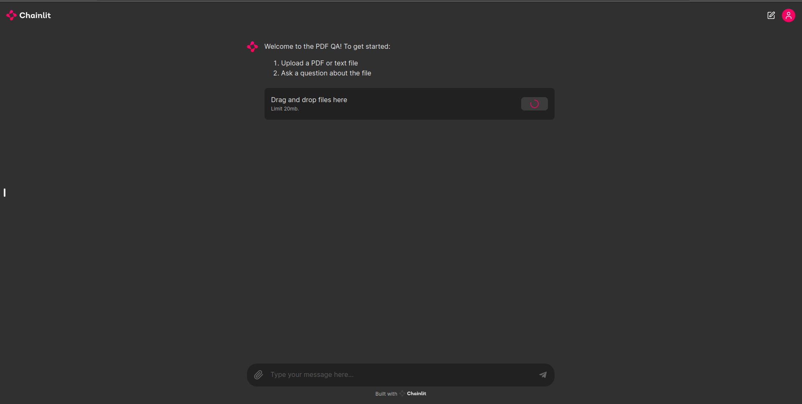

# PDF-reader-LangChain
This project is a simple RAG, that I will use a Vicuna model for reading information in a PDF file and answer the related question about that file.
- Input: The document file to be queried and a question related to the document's content.
- Output: The answer.

## Set up:
Note: Recommend use on colab (maybe on local, these package versions have conflicting dependencies).
- First, you need to clone my repo:
```sh
!git clone https://github.com/LapTruongQuang/PDF-reader-LangChain.git
```
- You need to install the requirements.txt
```sh
!pip install -r requirement.txt
```
- Check for the run.ypnb, i have some instructions in there to host the sever through ngrok (to run it on colab)

## Demo:



